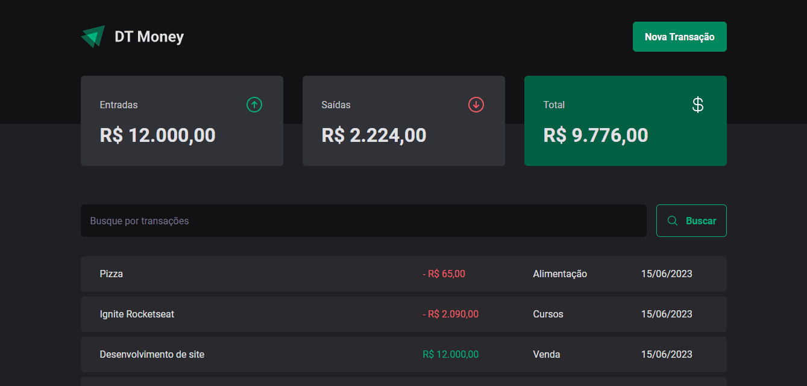

# DT Money



Projeto feito com Diego Fernandes, um dos instrutores da Rocketseat. Aprendi diversos conceitos como: RadixUI, JSON Server é Axios para requisição HTTP. Outros conceitos também foram abordados como utilização do useContextSelector, Memo, useMemo, useCallback é criação do meu proprio hook useSummary.

[Clique aqui para abrir o site de visualização](https://03-dt-money-tawny.vercel.app/)

## 🚀 Tecnologias

Esse projeto foi desenvolvido com as seguintes tecnologias:

- ReactJS
- TypeScript
- Styled-Components
- React Hook Form
- Zod
- RadixUI
- JSON Server
- Axios
- [Node e NPM](https://nodejs.org/)
- [Vite](https://vitejs.dev/)

**⚠️ ESTE PROJETO UTILIZA JSON SERVER**

```terminal
$ npm run dev:server
```